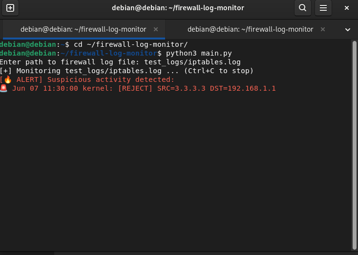

# 🔥 Firewall Log Monitor

A real-time log monitoring tool for Linux firewall (iptables) logs. Detects suspicious activity and sends alerts via Telegram and sound alarm.

## 🚀 Features

- 🕵️ Detects DROP, REJECT, PORTSCAN, and blocked traffic
- 📡 Sends Telegram alerts immediately
- 🔊 Plays sound alarm for local attention
- 🧠 Saves alerts with IP & timestamp in `alerts/alerts.json`
- 📂 Easy-to-read CLI output with color
- 💾 Works with `auth.log`, `iptables.log`, or any custom firewall log

## 📸 Screenshot



## ⚙️ Usage

```bash
python3 main.py


#When prompted:

Enter path to firewall log file: test_logs/iptables.log

#Add a test log entry:

echo "Jun 07 11:30:00 kernel: [DROP] SRC=1.2.3.4 DPT=22" >> test_logs/iptables.log

#📦 Requirements

    Python 3.x

    requests module

    mpg123 for sound alarm

#Install dependencies:

pip install -r requirements.txt
sudo apt install mpg123


#🛡️ Telegram Bot Setup

Create a bot with @BotFather and set:

    BOT_TOKEN and CHAT_ID via environment variables

export BOT_TOKEN="your_token_here"
export CHAT_ID="your_chat_id_here"
